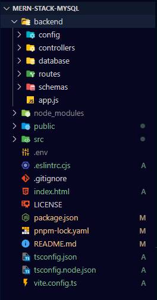

# MERN-stack-mysql

Based on this sites: 
* [MERN Stack con MySQL - React MySQL CRUD (Context API, TailwindCSS)](https://www.youtube.com/watch?v=dJbd7BYofp4) .
* [MERN Stack Tutorial - Book Store Project](https://www.youtube.com/watch?v=-42K44A1oMA).
* [Build REST API with NodeJS, MySQL, Sequelize, Typescript, Express step by step 2022 | REST API MySQL](https://www.youtube.com/watch?v=UcwT1SAvxG0).

## Starting steps
1. Install NPM and NODEJS in your system, using the `nvm`:
  [Install multiple versions of Node.js on Windows](https://rafaelneto.dev/blog/instalar-multiples-versiones-nodejs-windows/).
2. Create two directories in the root:
* backend
* frontend
3. In the same root using a terminal run this code, to create the "package.json" file:
```bash
npm init -y
```
4. Add in the "package.json" file below `"description":`, this one:
```json
      "type": "module",
```
5. install the libraries to use:
* `express`, the api and rest backend-server.
* `mysql2`, to connect to MySQL and promise support.
* `morgan`, to see by console the messages comming to backend.
```bash
pnpm i express mysql2 morgan
```
6. Install as develop the `nodemon` library, to keeps the backend-server running.
```bash
pnpm i nodemon -D
```
### Note: Those were my dependency versions:
+ express 4.18.2
+ morgan 1.10.0
+ mysql2 3.6.0
+ nodemon 3.0.1
7. Create a "index.js" and "config.js" files into "backend" directory.
8. Complete the "config.js" file with the `PORT` configuration:
```js
    export const PORT = process.env.PORT || 49146;
```
9. Fill the "index.js" with the basic `express` information to start the backend-server:
```js
    import express from 'express';
    import {PORT} from './config.js';

    const app = express();

    app.listen(PORT, ()=>{
      console.log(`Server is running on port ${PORT}`);
    });
```
10. Change the `"scripts":{}` in "package.json" file:
```json
      "scripts": {
        "start": "node ./backend/index.js",
        "dev": "nodemon ./backend/index.js"
      },
```
11. finally you can run in the Terminal, the command to start the backend-server.
```bash
pnpm dev
```
## ****************************************************************
## Sitation in the "Git bash" Terminal to show the current branch 
1. I ran this simple command in the Terminal
```bash
git branch
```
And It showme an error like `fatal: detected dubious ownership in repository`.

2. Then it suggests to run this command
```bash
git config --global --add safe.directory x:\path\directory\name
```
Just change the text `x:\path\directory\name`, for the real directory path.
## ****************************************************************

## Adding the database connection
1. Stop the backend-server if it is running.
2. Rename the "index.js" to "app.js".
3. Open the "SPackage.json" file and rename all "index.js" by "app.js".
4. Run again the server `pnpm dev` in Terminal.
5. Create in the "backend" directory the "config" directory.
6. Move the "config.js" file into this new "config" directory.
7. Add a ".env" file in the root of the directory, with this data:
```yml
    #------ MYSQL CONNECTION TO ANY SERVER -------
    MYSQL_HOST=localhost
    MYSQL_USER=root
    MYSQL_PASS=******
    MYSQL_D_B_=mern_stack_1
    MYSQL_PORT=3306
```
Change `MYSQL_PASS` by the correct in your system.
8. Install the program to read the ".env" file.
```bash
pnpm i dotenv
```
9. Call this file in the "config.js" file like this:
```js
    import * as dotenv from 'dotenv';
    dotenv.config();
```
10. Use one of this data in the "config.js" file:
```js
    export const MYSQL_HOST = process.env.MYSQL_HOST;
```
11. Just for test if this value is in use add this in in "app.js" file
```js
    import {PORT, MYSQL_HOST} from './config/config.js';
    ...
    app.listen(PORT, ()=>{
      console.log(`Server is running on port ${PORT},${MYSQL_HOST}`);
    });
```
12. If it is showing in the terminal this `Server is running on port 49146,localhost`, then delete this new info in the "app.js" file.

### Note: In the Video it is an explanation the Creation of a MySQL-Server with a Docker, but I previously have a MySQL Server installed.

13. Lets to a create a Database in MySQL server with the name: `mern_stack_1`, I use to use in "Character set" : `utf8 -- UTF-8 Unicode` and in the "Collation": `utf8_general_ci`.
14. Finally adding code in the "db.js" file:
```js
    import { createPool } from 'mysql2/promise';
    import { MYSQL_HOST, MYSQL_PORT, MYSQL_USER, MYSQL_PASS, MYSQL_D_B_ } from './config.js';

    console.log('MYSQL_HOST', MYSQL_HOST);
    export const pool = createPool({
      host: MYSQL_HOST,
      port: MYSQL_PORT,
      user: MYSQL_USER,
      password: MYSQL_PASS, 
      database: MYSQL_D_B_,
    });
```
15. Create a new directory called "routes" in the "backend" directory.
16. Create a file called "index.routes.js" into this "routes" directory.
17. Just import `{Router}` from 'express', in "index.routes.js" file.
18. Create a router from `Router()`;
19. import `{pool}` from '../config/db.js', in "index.routes.js" file.
20. Create an basic empty router and export it:
```js
    router.get('/ping', async(req, res) => {
    })
    export default router;
```
21. this is the data inside this new `router.get`:
```js
    router.get('/ping', async (req, res) => {
      const [rows, fields]=await pool.execute('SELECT 1+1 as result');
      console.log(rows, fields);
      res.json("ping");
    })
``` 
22. In "app.js" file  add `import indexRoutes from './routes/index.routes.js';`.
23. Add in "app.js" file this: `app.use(indexRoutes);`.
24. test in the Brwoser using this URL: [localhost:49146/ping](http://localhost:49146/ping), the answer must be `"ping"`, and in the Terminal must show:
```bash
[ { result: 2 } ] [ `result` BIGINT(3) NOT NULL ]
```

## Routes and controllers to interact with all CRUD methods.
1. Create a "tasks.routes.js" file into "backend/routes" directory, and add two lines:
```js
    import { Router } from 'express';
    const router = Router();
```
2. At the end of "tasks.routes.js" file add this: `export default router;`.
3. Add the routes in "tasks.routes.js" file between `const router = Router();` and `export default router;`:
```js
    router.get('/tasks');         //* Read all tasks and put in JSON
    router.post('/tasks');        //* Create a new task
    router.put('/tasks/:id');     //* Update only one task
    router.get('/tasks/:id');     //* Read only one task
    router.delete('/tasks/:id');  //* Delete only one task
```
4. I deleted the `console.log('MYSQL_HOST', MYSQL_HOST);` in "db.js" file.
5. Create a "controlles" directory in the "backend" directory.
6. Add a "tasks.controllers.js" file in the "controlles" directory. whit this simple text
```js
    export const getTasks=async(req,res, next)=>{
      res.send('Reading all Tasks');
    }
    export const getTask=async(req,res, next)=>{
      res.send('Reading one Task');
    }
    export const createTask=async(req,res, next)=>{
      res.send('Creating one Task');
    }
    export const updateTask=async(req,res, next)=>{
      res.send('Updating one Task');
    }
    export const deleteTask=async(req,res, next)=>{
      res.send('Deleting one Task');
    }
```
7. import `{ getTasks, getTask, createTask, updateTask, deleteTask }` from '../controllers/tasks.js', in "task.routes.js" file.
8. Add to each router the task-controller in "task.routes.js" file, example: `router.get('/tasks', getTasks);`.
9. Add the new route in "app.js" file, below of `app.use(indexRoutes);`:
```js
    app.use(tasksRoutes);
```
Remember import `tasksRoutes` from './routes/tasks.routes.js', in "app.js" file.

10. You can test as simple in the browser with the two `get` like: [localhost:49146/tasks](http://localhost:49146/tasks) or [localhost:49146/tasks/1](http://localhost:49146/tasks/1)

### Note: To test the other options in "Visual Studio Code" there are a "Thunder Client" extension.

## Create the Table called "tasks" in the **mern_stack_1** Database
1. Create a "database" directory into "backend", and add the "createTasksTable.js" file, with:
```js
    export const sqlCreateTasksTable =
      "-- Creating `tasks` table  \n" +
      "CREATE TABLE IF NOT EXISTS `tasks` (\n" +
      "  `id` BINARY(16) NOT NULL PRIMARY KEY ,\n" + // DEFAULT UNHEX(REPLACE(UUID(),'-',''))
      "  `title` VARCHAR(128) NOT NULL,\n" +
      "  `description` VARCHAR(256),\n" +
      "  `done` BOOLEAN NOT NULL DEFAULT 0,\n" +
      "  `created_at` TIMESTAMP NOT NULL DEFAULT CURRENT_TIMESTAMP,\n" +
      "  `updated_at` TIMESTAMP NOT NULL DEFAULT CURRENT_TIMESTAMP\n" +
      ");";
```
2. Create an "index.js" file into "/backend/database" directory, with the following:
```js
    import { pool } from '../config/db.js';
    import { sqlCreateTasksTable } from './createTasksTable.js';

    export const initAll = async () => {
      try {
        const [rows]=await pool.execute(sqlCreateTasksTable);
        await rows.warningStatus===1?console.log('Table Existed previously'):console.log('Table Created');
      } catch (error) { console.log(error); }
    }
```
3. Call the `initAll()` method in "app.js" file.
4. Finally it must create the table in the **mern_stack_1** Database

## POST /Tasks, the Creation or Insertion of the record

1. Add in "app.js" file, two elements below the `const app = express();`.
```js
    app.use(express.json());      // parse requests of content-type - application/json
    app.disable('x-powered-by');  // disable the header X-Powered-By: Express
```
2. Add in "task.controllers.js" file for the `createTask` method, this line to show the body: `console.log(req.body);`.
3. To the activity in **Thunder Client** for `POST` add in _Body_ this JSON:
```json
    {
      "title":"My First Task"
    }
```
And press [Send] button, this must be the aswer:
```bash
{ title: 'My First Task' }
```
4. Change again the _Body_ in the `POST` of **Thunder Client** activity the JSON for:
```json
    {
      "title":"My First Task",
      "description":"This is my first task "
    }
```
5. Import `{ pool }` from '../config/db.js', in "tasks.controllers.js" file.
6. Import `crypto` from 'crypto', in "tasks.controllers.js" file.
7. 
6. Change the `createTask` method with this:
```js
      const { title, description } = await req.body;
      const uuid = crypto.randomUUID();
      try {
        const result = await pool.query("INSERT INTO tasks(id, title, description) \n" +
          "VALUES (unhex(replace(?,'-','')), ?,?)", [uuid, title, description])
        res.status(201).json({
          ok: true,
          uuid,
          title,
          description,
          result
        });
      } catch (error) {
        console.log(error);
        res.status(501).json({
          ok: false,
          error
        });
      }
```

## Adding Validation of the each field
1. Install the `zod` library:
```bash
pnpm install zod -E
```
2. Create a "schemas" directory on "backend"
3. Add a "tasks.schemas.js" file.
4. Import `z` from 'zod', in the "tasks.schemas.js" file.
5. Add two regex to validate common text and the uuid values:
```js
    const regExpText = new RegExp("^[a-zA-Z0-9,.;:-_'\\s]+$");
    const regExpUuid = new RegExp("^[0-9a-fA-F]{8}\b-[0-9a-fA-F]{4}\b-[0-9a-fA-F]{4}\b-[0-9a-fA-F]{4}\b-[0-9a-fA-F]{12}$");
```
6. Complete the values to validate in a `const` of this schema:
```js
    const taskSchema = z.object({
      id: z.optional(z.string().regex(regExpUuid, { message: 'Id is not valid' })),
      title: z.string({
        invalid_type_error: 'Title must be a string',
        required_error: 'Title is required'
      }).min(5).max(128, { message: 'Title is max 128 length' }).regex(regExpText, { message: 'Title is not valid' }),
      description: z.string().max(256, { message: 'Description is max 256 length' }).regex(regExpText, { message: 'Description is not valid' }).optional(),
    });
```
7. Export the `ValidateTask`, returning the `safeParse` of the `taskSchema`, all in the "tasks.schemas.js" file.

## GET /Tasks, the Reading all the records or one.
1. Adding the Process in "tasks.controllers.js" file for `getTasks` method:
```js
      try {
          const [rows, fields, error] = await pool.query("SELECT (insert( insert( insert( insert(\n" +
            "   LCASE(hex(id))\n" +
            "   ,9,0,'-'), 14,0,'-'), 19,0,'-'), 24,0,'-') ) as id_text , \n" +
            " title, description, done, created_at, updated_at FROM tasks \n" +
            "ORDER BY created_at DESC;");
          res.status(200).json({ ok: true, rows });
        } catch (error) { res.status(501).json({ ok: false, error }); }
```
2. Adding the Process in "tasks.controllers.js" file for `getTask` method:
```js
      try {
        const uuid = req.params.id;
        const valTastk = await validateTask({ id: uuid, title: 'xoxoxo' }); // I sent any garbage in Title for Validation
        if (valTastk.error) return res.status(400).json({ ok: false, message: valTastk.error });
        const [rows, fields, error] = await pool.query("SELECT (insert( insert( insert( insert(\n" +
          "   LCASE(hex(id))\n" +
          "   ,9,0,'-'), 14,0,'-'), 19,0,'-'), 24,0,'-') ) as id_text , \n" +
          " title, description, done, created_at, updated_at FROM tasks \n" +
          "WHERE  id= unhex(replace(?,'-',''));", [uuid]);
        if (rows.length === 0) return res.status(404).json({ ok: false, message: "Task not found" });
        res.status(200).json({ ok: true, rows });
      } catch (error) { res.status(501).json({ ok: false, error }); }
```
### Note: A correction in "task.schemas.js" for `regExpUuid`, using the `\\` insted of `\`.

## DELETE /Tasks, Deleting record one by one.
1. Adding the Process in "tasks.controllers.js" file for `deleteTask` method:
```js
      try {
        const uuid = req.params.id;
        const valTastk = await validateTask({ id: uuid, title: 'xoxoxo' }); // I sent any garbage in Title for Validation
        if (valTastk.error) return res.status(400).json({ ok: false, message: valTastk.error });
        const [rows, fields, error] = await pool.query("DELETE FROM tasks \n" +
          "WHERE  id= unhex(replace(?,'-',''));", [uuid]);
        if (rows.length === 0 || rows.affectedRows === 0) return res.status(404).json({ ok: false, message: "Task not found" });
        res.status(200).json({ ok: true, rows });
      } catch (error) { res.status(501).json({ ok: false, error }); }
```
### Note: Adding some corrections to "task.schemas.js" and it affect the `validateTask` method.

## PUT /Tasks, Update one .
1. Adding the Process in "tasks.controllers.js" file for `updateTask` method:
```js
      try {
        const uuid = req.params.id;
        const bodyVal = { ...req.body, "id": uuid };
        const valTastk = await validateTask(bodyVal, 'U');
        console.log(req.body, bodyVal);
        const { title, description, done } = await req.body;
        if (valTastk.error) return res.status(400).json({ ok: false, message: valTastk.error });
        const [rows, fields, error] = await pool.query("UPDATE tasks SET updated_at=CURRENT_TIMESTAMP,? \n" +
          "WHERE  id= unhex(replace(?,'-',''));", [req.body, uuid]);
        console.log(rows);
        if (rows.length === 0 || rows.affectedRows === 0) return res.status(404).json({ ok: false, message: "Task not found" });

        res.status(200).json({
          ok: true,
          uuid,
          title: title,
          description: description,
          done: done,
          rows
        });
      } catch (error) { res.status(501).json({ ok: false, error }); }
```

## Frontend Setup, Starting the "React" application install
1. Stop the "backend" server or the `express` server.
2. I used [Vite](https://vitejs.dev/guide/), the best way to start any front-end project, with Typescrypt and a lot of templates. Delete the "frontend" directory and run this command in the root:
```bash
npm init vite@latest frontend --template react-ts
```
3. Delete the "node_modules" directory from the root.
4. Delete the "README.md" and ".gitignore" files from "frontend" directory
5. Copy some elements from "/package.json" into "frontend/package.json", to get something like this:
```js
      "dependencies": {
        "react": "^18.2.0",
        "react-dom": "^18.2.0",
        "dotenv": "^16.3.1",
        "express": "^4.18.2",
        "morgan": "^1.10.0",
        "mysql2": "^3.6.0",
        "zod": "3.22.2"
      },
      "devDependencies": {
        "@types/react": "^18.2.15",
        "@types/react-dom": "^18.2.7",
        "@typescript-eslint/eslint-plugin": "^6.0.0",
        "@typescript-eslint/parser": "^6.0.0",
        "@vitejs/plugin-react-swc": "^3.3.2",
        "eslint": "^8.45.0",
        "eslint-plugin-react-hooks": "^4.6.0",
        "eslint-plugin-react-refresh": "^0.4.3",
        "typescript": "^5.0.2",
        "vite": "^4.4.5",
        "nodemon": "^3.0.1"
      }
```
6. Delete the "package.json" file of the root.
7. Move the content "frontend" directory to the root.
8. Stay in the root" directory, and install `concurrently`, to run two Node commands in parallel.
```bash
pnpm i concurrently -D
```
9. In the root directory run the command to install all dependencies:
```bash
pnpm i
```
10. Delete the "frontend" directory.
11. Add this line below the `"type": "module",` : `"main": "./backend/app.js",`.
12. Delete in the scripts this line: `"dev": "vite",` and put this three lines:
```json
    "dev:frontend": "vite",
    "dev:backend": "nodemon ./backend/app.js",,
    "dev": "concurrently 'npm:dev:frontend' 'npm:dev:backend'",
```
13. You app’s directory structure should like this::

14. Run the command and you must have two servers (backend `express` and frontend `react`) running 
```bash
pnpm dev
```
